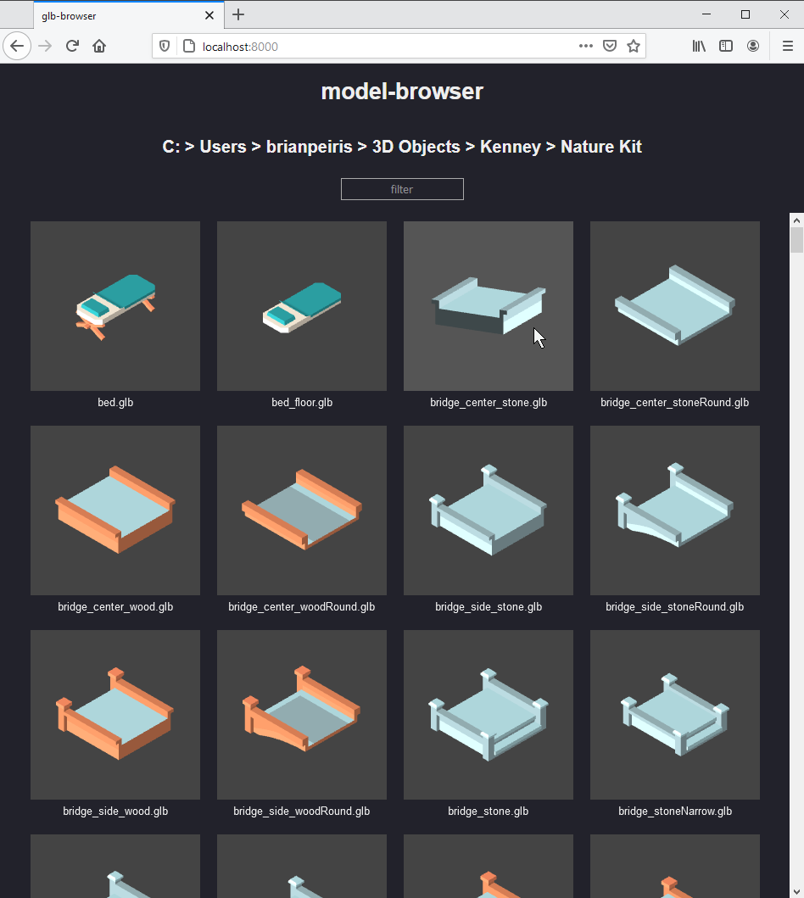

# model-browser

model-browser is a command line tool for browsing local 3D models via a web browser. It currently only supports GLB files.



## Installation and Usage

```
$ npm install -g model-browser
$ model-browser
```

OR 

```
$ npx model-browser
```

See `model-browser --help` for more details
